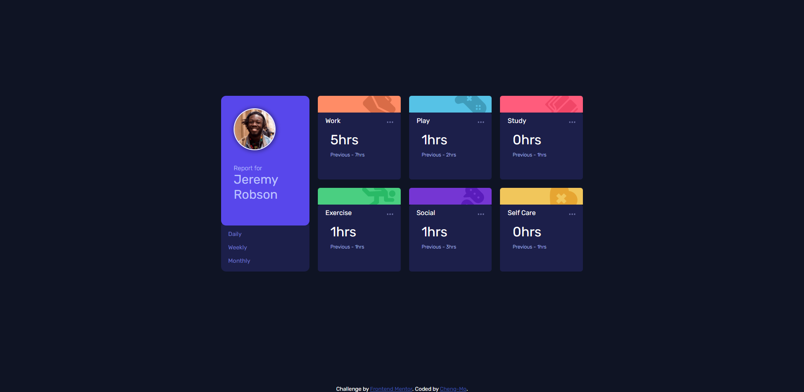

# Frontend Mentor - Time tracking dashboard solution

This is a solution to the [Time tracking dashboard challenge on Frontend Mentor](https://www.frontendmentor.io/challenges/time-tracking-dashboard-UIQ7167Jw). Frontend Mentor challenges help you improve your coding skills by building realistic projects. 

## Table of contents

- [Overview](#overview)
  - [The challenge](#the-challenge)
  - [Screenshot](#screenshot)
  - [Links](#links)
- [My process](#my-process)
  - [Built with](#built-with)
  - [What I learned](#what-i-learned)
  - [Continued development](#continued-development)
  - [Useful resources](#useful-resources)
- [Author](#author)
- [Acknowledgments](#acknowledgments)

**Note: Delete this note and update the table of contents based on what sections you keep.**

## Overview

### The challenge

Users should be able to:

- View the optimal layout for the site depending on their device's screen size
- See hover states for all interactive elements on the page
- Switch between viewing Daily, Weekly, and Monthly stats

### Screenshot

### Links

- Solution URL: [Solution](https://www.frontendmentor.io/solutions/responsive-time-track-dashboard-css-grids-js-eventlisteners-rJom9Fvm9)
- Live Site URL: [Live](https://medblutex.github.io/time-tracking-dashboard/)

## My process

### Built with

- Semantic HTML5 markup
- CSS custom properties
- Flexbox
- CSS Grid
- Mobile-first workflow
- JS EventListeners

### What I learned
((CSS))
- z-index needs a position other than static to work properly.
- a brilliant way to use overflow: hidden.
- opacity in hover state.
- mix-blend-mode.
((JS))
- hover equivalent using JS.
- differentiate between hover state sections using child-parent relationships and e.target.
- forEach to loop over nodeLists and don't use for or for in loops for this issue (problem)

To see how you can add code snippets, see below:

### Continued development

- Grid Concept.
- Objects and OOP.

**Note: Delete this note and the content within this section and replace with your own plans for continued development.**

### Useful resources

- [Grids](https://www.youtube.com/watch?v=t6CBKf8K_Ac) - I recommend this for anyone learning Grid Concept or need a refresher.

**Note: Delete this note and replace the list above with resources that helped you during the challenge. These could come in handy for anyone viewing your solution or for yourself when you look back on this project in the future.**

## Author

- Frontend Mentor - [@Cheng_Mo_](https://www.frontendmentor.io/profile/medblutex)
- Twitter - [@Cheng_Mo_](https://twitter.com/Cheng_Mo_)
